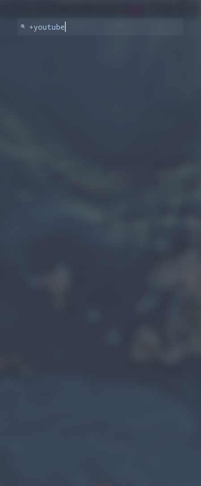

# rofi-bookmarks

Minimal bookmark manager for [rofi](https://github.com/DaveDavenport/rofi) launcher in bash.

## Requirements

* [rofi](https://github.com/DaveDavenport/rofi)
* [firefox](https://www.mozilla.org/en-US/firefox/linux/)

## Installation

* Clone this repository 
    `git clone https://github.com/Strix007/rofi-bookmarks.git`
* Make directory
    `mkdir -p ~/.config/rofi/bookmarks`
* Cd into this repository
    `cd rofi-bookmarks`
* Move the contents of this directory to ~/.config/rofi/bookmarks
    `mv * ~/.config/rofi/bookmarks`

## Usage

* Setup keybind to ~/.config/rofi/bookmarks/bookmarks.sh  in your WM or DE.

### Add Bookmark

* To add a bookmark, start the line with `+` then your url.

**Note:** If your bookmark does not contain a domain extension, it will default to `.com`.

### Remove Bookmark

* To remove a bookmark, start the line with `_` then your url.

**Note:** It fuzzy matches the input to the saved bookmarks.

### Addition Usage

* If you type a address that is not saved in your saved bookmarks, it will open the browser with that address.
  
**Note:** If the address does not contain a domain extension, it will default to a google search.

## Saved Bookmarks

* The bookmarks are saved in a hidden plain text file in ~/.config/rofi/bookmarks/.bookmarks.
* You can manually add bookmarks to `~/.config/rofi/bookmarks/.bookmarks` by starting a new line and adding your bookmark.
    For Example -
    `youtube.com`
    **Note:** Make sure every bookmark is on a seperate line.
